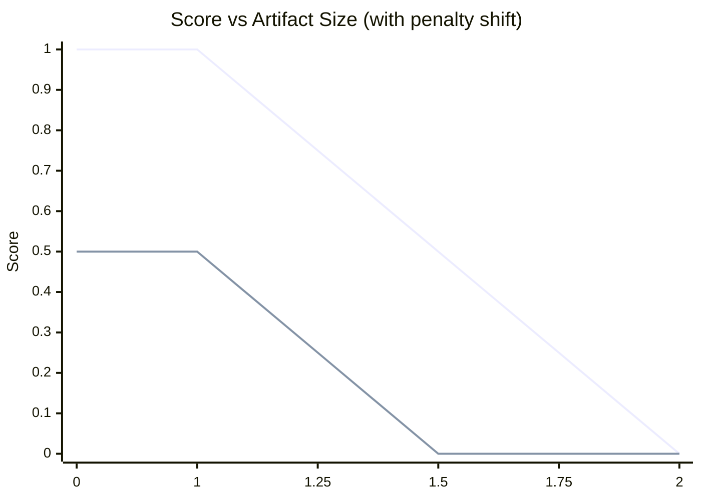
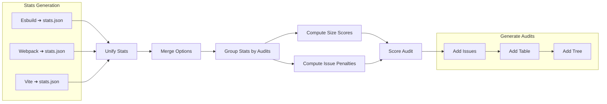

# 📦 **Bundle Budget Plugin**

**Bundle size tracking for your build artifacts**  
Track, compare, and prevent bundle size regressions to maintain web performance (e.g. LCP) across product areas.

---

### 🧪 **Reference PR**

👉 [**#1024 – BundleBudget Plugin PoC Implementation**](https://github.com/code-pushup/cli/pull/1024)

---

## User story

As a developer, I want to **track bundle size regressions per product area and route**,  
so that we can **avoid performance regressions** and optimize **LCP over time**.

The plugin should:

- Analyze `stats.json` output from different bundler.
- Identify and compare **main**, **initial**, and **lazy** chunks over glob matching
- Use **chunk input fingerprinting** to map renamed chunk files.
- Group chunk sizes by route/product (e.g., `/route-1`, `/route-2`).
- give penalties for site and blacklisted imports
- visualise inputs as well as static imports as they directly contribute to the real bundle size.
- Store and compare bundle stats across versions/releases.

## Metric

**Bundle size** in bytes.
Parsed from `--stats-json` output and grouped by file.

| **Property**     |            **Value** | **Description**                     |
| ---------------- | -------------------: | ----------------------------------- |
| **value**        |             `132341` | Total size of all chunks.           |
| **displayValue** | `13.4 MB / 13 Files` | Display value inc. number of files. |

## Integration Requirements

The plugin can be implemented in 2 ways:

1. Using stats files
2. Crawling the filesystem

As stats file serve significantly more details and are state of the art when debugging bundle size this issue favours this approach.

### Using Stats Files

Bundle stats are detailed metadata about your build outputs—listing each generated file, its original inputs, and any static imports—exported via a metafile (e.g. from ESBuild or other bundlers).

Generate a stats file with ESBuild:

```shell
esbuild src/index.js --bundle  --outfile=dist/bundle.js  --metafile=stats.json
```

The resulting file maintains the following data structure:

```txt
EsbuildBundleStats                          # Root object containing all bundle stats
├── inputs (Record<string, MetafileInput>)  # Map of each source input file to its metadata
│   └── <inputPath>                         # File path of a specific input module
│       ├── bytes: number                    # Size of this input module in bytes
│       └── imports (MetafileImport[])      # List of static imports declared by this input
│           └── [ ]                          # Array of import entries
│               ├── path: string             # Resolved filesystem path of the imported module
│               ├── kind: ImportKind         # Import type (e.g. "import", "require", "dynamic")
│               ├── external?: boolean       # True if marked external (excluded from bundle)
│               └── original?: string        # Original import specifier in source code
└── outputs (Record<string, MetafileOutput>)# Map of each generated output file to its metadata
    └── <outputPath>                        # File path of a specific output chunk
        ├── bytes: number                    # Total size of this output file in bytes
        ├── inputs (Record<string,MetafileOutputInput>) # Map of input modules contributing to this output
        │   └── <inputPath>                 # Path of an input that fed into this output
        │       └── bytesInOutput: number    # Number of bytes this input contributed to the output
        ├── imports (MetafileImport[])      # List of static imports found in this output
        │   └── [ ]                          # Array of import entries
        │       ├── path: string             # Resolved filesystem path of the imported module
        │       ├── kind: ImportKind         # Import type (e.g. "import", "require", "dynamic")
        │       ├── external?: boolean       # True if marked external (excluded from bundle)
        │       └── original?: string        # Original import specifier in source code
        ├── exports: string[]                # List of named exports provided by this bundle
        └── entryPoint?: string              # Entry-point module path for this output chunk, if any
```

#### File Type Definitions

|        **Type** | **Structure**                    | **Description**                                                                             |
| --------------: | -------------------------------- | ------------------------------------------------------------------------------------------- |
|        `inputs` | `Record<string, MetafileInput>`  | Map of each source file path to its metadata (bytes and imports).                           |
|       `imports` | `MetafileImport[]`               | Array of import entries, each with `path`, `kind`, and optional flags.                      |
|    📄 `outputs` | `Record<string, MetafileOutput>` | Map of each output file path to its metadata (bytes, inputs, imports, exports, entryPoint). |
| 📍 `entryPoint` | `string` (optional)              | The entry-point module path for this output chunk, if present.                              |

The plugin will use this information to gather the configured artefact groups.

### Crawling the filesystem

> [!note]
> No research done as not scaleable

## Setup and Requirements

### 📦 Package Dependencies

- **Dev Dependencies:**
  - None required, optional CLI runner for local debugging.
- **Optional Dependencies:**
  - [esbuild](https://www.npmjs.com/package/esbuild)
  - [rsbuild](https://www.npmjs.com/package/rsbuild)
  - [webpack](https://www.npmjs.com/package/webpack)
  - [vite](https://www.npmjs.com/package/vite)
  - or any tool that emits `--metafile`/`stats.json`.

### 📝 Configuration Files

- `angular.json` / `vite.config.ts` or equivalent – for custom build config.
- No required config file for the plugin itself.

---

### Bundle Stats

The following is a minimal stats representation used to explain different features of the plugin. It will be referred to as **Example Stats**.

```
stats.json
└── outputs
    ├── dist/index.js                                    // entryPoint: src/index.ts
    │   ├── inputs
    │   │   └── src/index.ts
    │   │       ├── src/lib/feature-1.ts                // import-statement
    │   │       │   └── src/lib/utils/format.ts         // import-statement
    │   │       ├── src/lib/utils/math.ts               // import-statement
    │   │       └── src/lib/feature-2.ts                // dynamic-import
    │   └── imports
    │       ├── dist/chunks/chunk-U6O5K65G.js           // import-statement
    │       └── dist/chunks/feature-2-X2YVDBQK.js       // dynamic-import
    ├── dist/bin.js                                      // entryPoint: src/bin.ts
    │   ├── inputs
    │   │   └── src/bin.ts
    │   │       ├── src/lib/feature-1.ts                // import-statement
    │   │       │   └── src/lib/utils/format.ts         // import-statement
    │   │       └── src/lib/utils/math.ts               // import-statement
    │   └── imports
    │       └── dist/chunks/chunk-U6O5K65G.js           // import-statement
    ├── dist/chunks/chunk-U6O5K65G.js
    │   └── inputs
    │       ├── src/lib/utils/format.ts
    │       ├── src/lib/feature-1.ts
    │       └── src/lib/utils/math.ts
    └── dist/chunks/feature-2-X2YVDBQK.js               // entryPoint: src/lib/feature-2.ts
        └── inputs
            └── src/lib/feature-2.ts
```

## Features

@TODO

### General

The audit name is provided over the `title` property. Internally a audit `slug` is derived from the

- **`title`**: A unique identifier for this group.
- **`description`**: One two sentences explaining the purpose of the audit

**Types**

```ts
type Audit = {
  slug?: string;
  title: string;
  description?: string;
};
```

**Example Configuration**

```ts
const audit1: Audit = {
  title: 'Initial Bundles',
};

const audit2: Audit = {
  slug: 'app-core',
  title: '🧱App Core',
  description: 'This audit checks the core functionality of the app.',
};
```

Every audit gets the merged configuration of the global and audit specific configuration listed in the description.

**Configuration Example**

```ts
const config: BundleStatsConfig = {
  title: 'Initial Bundles',
  description: 'This audit checks the initial bundles of the app.',
};
```

**Report Output**

```txt
This audit checks the initial bundles of the app.
<details>
<summary>⚙️ Config Summary</summary>

**Selection**
• `includeOutputs`: `**/*`

**Scoring**
• `totalSize`: `0 B – 97.66 kB`

**Insights**
• 🔧 `**/math.ts`
• 🔧 `**/format.ts`
• 🧩 `**/*feature-2*`
• 🏁 `src/index.ts, src/bin.ts`
• 🤝 `dist/chunks/chunk-*.js`
• 📦 `**/node_modules/**`
• 📦 `dist/index.js, dist/bin.js`

</details>
```

### Selection

To select files for an audit, glob patterns are used to include and exclude parts of the output files.
All options are provided as glob patterns matching either `path`, `path` in `inputs` or `entryPoint`.

**Types**

```ts
export interface SelectionOptions {
  mode: 'bundle' | 'onlyMatching' | 'withAllDeps' | 'withStartupDeps';

  // targeting output path of a `OutputNode`
  includeOutputs: string[];
  excludeOutputs: string[];

  // targeting input paths of a `OutputNode`
  includeInputs: string[];
  excludeInputs: string[];
}
```

**Example Configuration**

```ts
const selection: SelectionOptions = {
  mode: 'bundle',
  includeOutputs: ['**/features/*'],
  excludeOutputs: ['**/features/legacy/**'],
  excludeInputs: ['**/ui/**'],
};
```

#### Selection Behaviour

- **🎯Glob syntax**: Supports standard glob patterns like `*`, `**`, `?`, `[abc]`.
- **Include → Exclude**: Selection starts with `include*` patterns (for outputs and inputs), followed by `exclude*` to remove matches.
- **Precedence**: If a file matches both `include` and `exclude`, it will be excluded.
- **🔗 Dependency handling** is controlled by `mode`:
  - `'bundle'` and `'onlyMatching'` ignore imports.
  - `'withAllDependencies'` and `'withStartupDependencies'`: preserve imports even if excluded

---

> All examples target this stats data.
>
> **Example Stats**
>
> The following is a minimal stats representation used to explain different features of the selection process.
>
> ```
> stats.json
> └── outputs
>   ├── dist/index.js 309kB                             // entryPoint: src/index.ts
>    │   ├── inputs
>    │   │   └── src/index.ts
>    │   │       ├── src/lib/feature-1.ts  100kB         // import-statement
>    │   │       │   └── src/lib/utils/format.ts  100kB  // import-statement
>    │   │       ├── src/lib/utils/math.ts  100kB        // import-statement
>    │   │       └── src/lib/feature-2.ts  100kB         // dynamic-import
>    │   └── imports
>    │       ├── dist/chunks/chunk-U6O5K65G.js           // import-statement
>    │       └── dist/chunks/feature-2-X2YVDBQK.js       // dynamic-import
>    ├── dist/bin.js 309kB                               // entryPoint: src/bin.ts
>    │   ├── inputs
>    │   │   ├── src/lib/feature-1.ts  100kB             // import-statement
>    │   │   │   └── src/lib/utils/format.ts  100kB      // import-statement
>    │   │   └── src/lib/utils/math.ts  100kB            // import-statement
>    │   └── imports
>    │       └── dist/chunks/chunk-U6O5K65G.js           // import-statement
>    ├── dist/chunks/chunk-U6O5K65G.js 309kB
>    │   └── inputs
>    │       ├── src/lib/utils/format.ts 100kB
>    │       ├── src/lib/feature-1.ts 100kB
>    │       └── src/lib/utils/math.ts 100kB
>    └── dist/chunks/feature-2-X2YVDBQK.js  109kB        // entryPoint: src/lib/feature-2.ts
>        └── inputs
>            └── src/lib/feature-2.ts 100kB
>
> ```

---

##### Include Output

Select only `dist/index.js` and its dependencies.

**Selection Options**

```ts
{
  includeOutputs: ['**/dist/index.js'];
}
```

**Selection Result:**

```
stats.json
└── outputs
    ├── 🎯 dist/index.js                                    // entryPoint: src/index.ts
    │   ├── inputs
    │   └── imports
    │       └── dist/chunks/chunk-U6O5K65G.js               // import-statement
    └── 🔗 dist/chunks/chunk-U6O5K65G.js                    // imported by `dist/index.js`
        └── inputs
```

The target output and its imported dependencies are included.

##### Include/Exclude Output

Select all outputs except bin files.

**Selection Options**

```ts
{
  includeOutputs: ["**/*"],
  excludeOutputs: ["**/bin.js"]
}
```

**Selection Result:**

```
stats.json
└── outputs
    ├── 🎯 dist/index.js                                    // entryPoint: src/index.ts
    ├── 🔗 dist/chunks/chunk-U6O5K65G.js                    // imported by `dist/index.js`
    ├── 🔗 dist/chunks/feature-2-X2YVDBQK.js               // imported by `dist/index.js`
    └── // excluded: dist/bin.js
```

All outputs are included except those matching the exclude pattern.

##### Include Input

Select outputs that contain specific input files.

**Selection Options**

```ts
{
  includeInputs: ['**/feature-2.ts'];
}
```

**Selection Result:**

```
stats.json
└── outputs
    ├── dist/index.js                                    // entryPoint: src/index.ts
    │   └── inputs
    │       └── src/index.ts
    │           └── 🎯 src/lib/feature-2.ts               // dynamic-import
    └── 🔗 dist/chunks/feature-2-X2YVDBQK.js             // contains feature-2.ts
        └── inputs
            └── 🎯 src/lib/feature-2.ts
```

Only outputs containing the specified input files are included.

##### Include/Exclude Input

Select all outputs but exclude those containing feature-2 files.

**Selection Options**

```ts
{
  includeOutputs: ["**/*"],
  excludeInputs: ["**/feature-2.ts"]
}
```

**Selection Result:**

```
stats.json
└── outputs
    ├── 🎯 dist/bin.js                                      // entryPoint: src/bin.ts
    ├── 🔗 dist/chunks/chunk-U6O5K65G.js                    // imported by `dist/bin.js`
    ├── // excluded: dist/index.js (contains feature-2.ts)
    └── // excluded: dist/chunks/feature-2-X2YVDBQK.js (contains feature-2.ts)
```

Outputs containing the excluded input files are filtered out.

##### Include/Exclude Mixed

Select feature outputs but exclude utility files.

**Selection Options**

```ts
{
  includeOutputs: ['**/features/*', '**/index.js'],
  excludeOutputs: ['**/bin.js'],
  excludeInputs: ['**/utils/**']
}
```

**Selection Result:**

```
stats.json
└── outputs
    ├── 🎯 dist/index.js                                    // matches includeOutputs
    │   └── inputs
    │       └── src/index.ts
    │           ├── src/lib/feature-1.ts  100kB
    │           └── src/lib/feature-2.ts  100kB
    └── 🔗 dist/chunks/feature-2-X2YVDBQK.js               // imported by `dist/index.js`
        └── inputs
            └── src/lib/feature-2.ts 100kB
```

Complex filtering combines output and input patterns for precise selection.

---

##### Mode: `onlyMatching`

Select only input files that match a pattern — exclude outputs, imports, and bundler overhead.

**Selection Options**

```ts
{
  mode: 'onlyMatching',
  includeInputs: ['**/lib/utils/format.ts']
}
```

**Selection Result:**

```
stats.json
└── outputs
    ├── dist/chunks/chunk-U6O5K65G.js  100kB              // excludes overhead
        └── inputs
            └── 🎯 src/lib/utils/format.ts 100kB          // matches `includeInputs`
```

Only the bytes from matching input files are counted, excluding bundler overhead.

##### Mode: `bundle`

Include the full output bundle with overhead and its bundled inputs but not external chunks.

**Selection Options**

```ts
{
  mode: 'bundle',
  includeOutputs: ['**/dist/index.js']
}
```

**Selection Result:**

```
stats.json
└── outputs
    └── 🎯 dist/index.js 209kB                            // matches `includeOutputs`
        └── inputs
            ├── src/lib/utils/format.ts 100kB
            └── src/lib/utils/math.ts 100kB
```

Only what's bundled directly in the output file is included.

##### Mode: `withStartupDeps`

Include the output and all static imports required at startup.

**Selection Options**

```ts
{
  mode: 'withStartupDeps',
  includeOutputs: ['**/dist/index.js']
}
```

**Selection Result:**

```
stats.json
└── outputs
    ├── 🎯 dist/index.js 209kB
    │   └── inputs
    │       ├── src/lib/utils/format.ts 100kB
    │       └── src/lib/utils/math.ts 100kB
    └── 🔗 dist/chunks/chunk-U6O5K65G.js 109kB           // statically imported by `dist/index.js`
        └── inputs
            └── src/lib/utils/log.ts 100kB
```

Static imports are preserved even if they would be excluded by patterns.

##### Mode: `withAllDeps`

Include the output and all imported files — both static and dynamic.

**Selection Options**

```ts
{
  mode: 'withAllDeps',
  includeOutputs: ['**/dist/index.js']
}
```

**Selection Result:**

```
stats.json
└── outputs
    ├── 🎯 dist/index.js 209kB
    │   └── inputs
    │       ├── src/lib/utils/format.ts 100kB
    │       └── src/lib/utils/math.ts 100kB
    ├── 🔗 dist/chunks/chunk-U6O5K65G.js 109kB           // static import
    │   └── inputs
    │       └── src/lib/utils/log.ts 100kB
    └── 🔗 dist/chunks/feature-2-X2YVDBQK.js 109kB       // dynamic import
        └── inputs
            └── src/lib/feature-2.ts 100kB
```

Both static and dynamic dependencies are included in their entirety.

### Scoring

> **What makes up the output bytes:**
>
> - **Inputs**: Sum of `bytesInOutput` from contributing files
> - **Overhead**: Bundler-generated code (runtime, wrappers, loaders, etc.)
>
> 📌 `output.bytes = inputs + overhead`

The plugin assigns a **score** in the range `[0 … 1]` to each artefact (or artefact selection) based on:

1. **Size** vs. a configurable maximum threshold
2. **Diagnostics penalties** (errors & warnings, including blacklist violations as warnings)

A perfect score (`1`) means “within budget”; lower values indicate regressions.

The selection process of a scored set of files is explained in detail in [File Selection](#File-Selection)

**Types**

```ts

export interface ScoringOptions {
  // targeting output path of a `OutputNode`
  totalSize: number | MinMax;
  penalty: {
    artefactSize?: number | MinMax;
    blacklist?: string[];
  }
```

**Example Configuration**

```ts
const selection: SelectionOptions = {
  includeOutputs: ['**/features/*'],
  excludeOutputs: ['**/features/legacy/**'],
  excludeInputs: ['**/ui/**'],
  includeEntryPoints: ['**/features/auth/*.ts'],
};
```

#### Total Size

Every artefact selection has budgets assigned under `budget`.

- **`totalSize`**: Total bytes of all files in a selection.

**Examples**

```ts
const scoring1: Scoring = {
  totalSize: 300_000,
};

const scoring2: Scoring = {
  totalSize: [10_000, 300_000],
};
```

#### Panelties

To give actionable feedback to users of the plugin you can add penalties a set of penalties:

- **`artefactSize`**: Byte size of a files in a selection.
- **`blacklist`**: List of globs to flag inputs as well as imports as forbidden

**Types**

```ts
type Penalty = {
  artefactSize?: number | MinMax;
  blacklist?: string[];
};
```

**Example Configuration**

```ts
const penalty1: Penalty = {
  artefactSize: 50_000,
};

const penalty2: Penalty = {
  artefactSize: [1_000, 50_000],
  blacklist: ['node_modules/old-charting-lib'],
};
```

#### Scoring Parameters

| **Parameter** | **Description**                                                        |
| ------------: | ---------------------------------------------------------------------- |
|           `S` | Actual bytes                                                           |
|           `M` | Size threshold bytes                                                   |
|           `E` | Count of issues of severity errors (🚨)                                |
|           `W` | Count of issues of severity warnings (⚠️), including blacklist matches |
|          `we` | Weight per error (default `1`)                                         |
|          `ww` | Weight per warning (default `0.5`)                                     |

##### Size score

$`
\mathrm{sizeScore} =
\begin{cases}
1, & S \le M\\[6pt]
\max\bigl(0,\;1 - \tfrac{S - M}{M}\bigr), & S > M
\end{cases}
`$

##### Issues penalty

$`
\mathrm{penalty} = we \times E \;+\; ww \times W
`$

##### Final blended score

$`
\mathrm{finalScore} = \max\!\Bigl(0,\;\mathrm{sizeScore} - \frac{\mathrm{penalty}}{we + ww}\Bigr)
`$



### Issues

To give users actionable feedback we need to be able to tell _WHAT_ happened, _WHERE_ it is, and _HOW_ to fix it.

Issues are configured per audit under the `scoring.penalty` property.
The plugin creates **diagnostics** for each penalty. The table below shows all diagnostic types:

| Diagnostic      | Description                                                                                           | Config Key        | Default | Severity | Recommended Action                                                      |
| --------------- | ----------------------------------------------------------------------------------------------------- | ----------------- | ------- | -------- | ----------------------------------------------------------------------- |
| **Blacklisted** | Artifact contains an import matching a forbidden glob pattern.                                        | `blacklist`       | —       | 🚨 Error | Remove or replace the forbidden dependency.                             |
| **Too Large**   | Artifact exceeds the maximum allowed size. May indicate an unoptimized bundle or accidental check-in. | `maxArtifactSize` | `5 MB`  | 🚨 Error | Review and optimize (e.g. code splitting, compression).                 |
| **Too Small**   | Artifact is below the minimum expected size. Could signal missing dependencies or incomplete build.   | `minArtifactSize` | `1 KB`  | ⚠️ Warn  | Verify that the build output is complete and dependencies are included. |

#### Too Large Issues

Artifacts that exceed the maximum allowed size threshold. This typically indicates unoptimized bundles, accidental inclusion of large files, or missing code splitting strategies.

**Configuration**: `scoring.artifactSize`

**Example Issues:**

| Severity | Message                                                                                         | Source file          | Location |
| -------- | ----------------------------------------------------------------------------------------------- | -------------------- | -------- |
| 🚨 error | `main.js` is **6.12 MB** (exceeds 5 MB); consider splitting or compressing this bundle.         | `dist/lib/main.js`   |          |
| 🚨 error | `vendor.js` is **2.05 MB** (exceeds 1.5 MB); apply tree-shaking or extract shared dependencies. | `dist/lib/vendor.js` |          |

**Use Cases**:

- **Code Splitting**: Break large bundles into smaller chunks
- **Tree Shaking**: Remove unused code from dependencies
- **Compression**: Enable gzip/brotli compression
- **Asset Optimization**: Optimize images and other assets
- **Lazy Loading**: Load code only when needed

#### Too Small Issues

Artifacts that fall below the minimum expected size threshold. This could signal missing dependencies, incomplete builds, or configuration issues.

**Configuration**: `scoring.artifactSize`

**Example Issues:**

| Severity   | Message                                                                                  | Source file           | Location |
| ---------- | ---------------------------------------------------------------------------------------- | --------------------- | -------- |
| ⚠️ warning | `utils.js` is **50 kB** (below 100 kB); confirm that expected dependencies are included. | `dist/lib/utils.js`   |          |
| ⚠️ warning | `styles.css` is **10 B** (below 1 kB); confirm that expected dependencies are included.  | `dist/lib/styles.css` |          |

**Use Cases**:

- **Dependency Check**: Verify all required dependencies are included
- **Build Verification**: Ensure the build process completed successfully
- **Configuration Review**: Check bundler configuration for missing entries
- **Source Validation**: Confirm source files contain expected content

#### Blacklisted Issues

Artifacts containing imports that match forbidden glob patterns. This helps enforce dependency policies and prevent usage of deprecated or unsafe libraries.

**Configuration**: `scoring.blacklist`

**Example Issues:**

| Severity | Message                                                                                                  | Source file           | Location |
| -------- | -------------------------------------------------------------------------------------------------------- | --------------------- | -------- |
| 🚨 error | `node_modules/old-charting-lib/index.js` matches a blacklist pattern; remove or replace this dependency. | `src/main-ASDFGAH.js` |          |

**Use Cases**:

- **Dependency Replacement**: Replace blacklisted libraries with approved alternatives
- **Code Refactoring**: Remove usage of forbidden dependencies
- **Policy Review**: Update dependency policies if needed
- **Security Audit**: Investigate security implications of blacklisted dependencies

### Insights Table

The insights table summarizes different areas of the selected files by grouping data based on patterns. It aggregates bytes from outputs, their inputs, and overhead.

**Process for accurate data:**

For each **group**, evaluate its **patterns** and:

- Sum bytes from inputs whose paths match the pattern
- Include output file bytes if the file path matches the pattern (including bundler overhead)

Each byte can only be assigned once to avoid duplication.

**After processing:**

- Unmatched bytes go to the fallback "_Rest_" group
- Remaining bundler overhead (from unmatched outputs) is also included in _Rest_

**Types**

```ts
type InsightsOptions = {
  title?: string;
  patterns: string[];
  icon?: string;
}[];
```

**Complete Example Configuration**

```ts
const insightsOptions: InsightsOptions = [
  {
    title: 'App Shell',
    icon: '🖥️',
    patterns: ['**/app/**', '**/main.ts'],
  },
  {
    title: 'Angular',
    icon: '🅰️',
    patterns: [
      '**/node_modules/@angular/**',
      '**/node_modules/ngx-*/**',
      '**/node_modules/@ngrx/**',
      '**/node_modules/ng-*/**',
      '**/node_modules/*angular*',
      '**/zone.js/**',
    ],
  },
  {
    title: 'Styles',
    icon: '🎨',
    patterns: ['**/*.css', '**/*.scss'],
  },
  {
    title: 'Shared Utilities',
    icon: '🧩',
    patterns: ['**/shared/**', '**/utils/**'],
  },
  {
    title: 'Feature: Checkout',
    icon: '🛒',
    patterns: ['**/features/checkout/**'],
  },
  {
    title: 'Feature: Profile',
    icon: '👤',
    patterns: ['**/features/profile/**'],
  },
  {
    title: 'Third-party Vendors',
    icon: '📦',
    patterns: ['**/node_modules/**'],
  },
];
```

**Example Output:**

| Group                  | Size     | Modules |
| ---------------------- | -------- | ------- |
| 📦 Third-party Vendors | 1.78 MB  | 152     |
| 🖥️ App Shell           | 85.32 kB | 14      |
| 🅰️ Angular             | 236.4 kB | 19      |
| 🎨 Styles              | 12.2 kB  | 7       |
| 🧩 Shared Utilities    | 98.3 kB  | 28      |
| 🛒 Feature: Checkout   | 142.9 kB | 33      |
| 👤 Feature: Profile    | 65.7 kB  | 21      |
| Rest                   | 27.4 kB  | 6       |

### Dependency Tree

The dependency tree provides users with a quick understanding of the dependencies graph of selected artifacts. It serves as a replacement for opening bundle stats in the browser to search for respective files.

**Types**

```ts
export type ViewMode = 'all' | 'onlyMatching';

export type GeneralViewConfig = {
  enabled: boolean;
  mode: ViewMode;
};

export type DependencyTreeConfig = GeneralViewConfig & {
  groups: GroupingRule[] | false;
  pruning: PruningConfig;
};

export interface GroupingRule {
  include: string | string[];
  exclude?: string | string[];
  title?: string;
  icon?: string;
  numSegments?: number;
}

export interface PruningConfig {
  maxChildren?: number;
  maxDepth?: number;
  startDepth?: number;
  minSize?: number;
  pathLength?: number | false;
}
```

**Example Configuration**

```ts
const treeConfig: DependencyTreeConfig = {
  mode: 'all',
  groups: [
    {
      title: 'Angular Router',
      include: ['node_modules/@angular/router/**'],
      exclude: ['**/*.spec.ts'],
      icon: '🅰️',
      numSegments: 3,
    },
  ],
  pruning: {
    maxChildren: 3,
    maxDepth: 2,
    startDepth: 1,
    minSize: 10_000,
    pathLength: 50,
  },
};
```

---

> All examples target this stats data structure.
>
> **Example Stats**
>
> ```
> stats.json
> └── outputs
>     └── dist/index.js 400kB
>         ├── inputs
>         │   ├── src/index.ts 50kB
>         │   ├── src/lib/feature-1.ts 100kB
>         │   └── src/lib/utils/format.ts 75kB
>         └── imports
>             └── dist/chunks/vendor.js
> ```

---

#### Mode: `all`

Shows complete dependency tree including all outputs, inputs, and imports with full bundler overhead.

**Tree Configuration**

```ts
{
  mode: 'all';
}
```

**Tree Result:**

```txt
example-group
├── dist/index.js
│   ├── src/index.ts
│   ├── src/lib/feature-1.ts
│   └── src/lib/utils/format.ts
├── dist/chunks/vendor.js
│   └── node_modules/@angular/router/index.ts
└── dist/styles.css
```

#### Mode: `onlyMatching`

Shows only the bytes that match selection patterns, excluding bundler overhead.

**Tree Configuration**

```ts
{
  mode: 'onlyMatching';
}
```

**Tree Result:**

```txt
example-group
├── dist/index.js
│   ├── src/index.ts
│   ├── src/lib/feature-1.ts
│   └── src/lib/utils/format.ts
├── dist/chunks/vendor.js
│   └── node_modules/@angular/router/index.ts
└── dist/styles.css
```

---

#### Grouping - Disabled

**Tree Result:**

```txt
example-group
└── entry-2.js
    ├── node_modules/@angular/router/provider.ts
    ├── node_modules/@angular/router/service.ts
    │   └── node_modules/@angular/router/utils.ts
    └── node_modules/lodash/chunk.js
```

#### Grouping - Basic

**Grouping Configuration**

```ts
{
  groups: [
    {
      title: 'Angular Router',
      include: ['node_modules/@angular/router/**'],
      exclude: ['**/*.spec.ts'],
      icon: '🅰️',
    },
  ];
}
```

**Tree Result:**

```txt
example-group
└── entry-2.js
    ├── 🅰️ Angular Router
    │   ├── node_modules/@angular/router/provider.ts
    │   ├── node_modules/@angular/router/service.ts
    │   └── node_modules/@angular/router/utils.ts
    └── node_modules/lodash/chunk.js
```

#### Grouping - Include/Exclude

GroupingRule supports flexible pattern matching with include/exclude logic:

- **`include`**: Patterns to match files for inclusion in the group
- **`exclude`**: Patterns to exclude from the group (optional)
- **Pattern precedence**: Files matching both include and exclude will be excluded

**Advanced Grouping Configuration**

```ts
{
  groups: [
    {
      title: 'React Components',
      include: ['**/components/**/*.tsx', '**/components/**/*.jsx'],
      exclude: ['**/*.test.*', '**/*.spec.*'],
      icon: '⚛️',
    },
    {
      title: 'Node Modules',
      include: ['node_modules/**'],
      exclude: ['node_modules/**/*.d.ts'],
      icon: '📦',
    },
  ];
}
```

#### Grouping - NumSegments

The `numSegments` property controls how files are grouped by their path structure.

**Without numSegments:**

```txt
example-group
└── entry.js
    ├── src/components/ui/Button.tsx
    ├── src/components/ui/Modal.tsx
    ├── src/components/forms/Input.tsx
    └── src/components/forms/Select.tsx
```

**Grouping Configuration**

```ts
{
  groups: [
    {
      title: 'Components',
      include: ['**/components/**'],
      numSegments: 2,
    },
  ];
}
```

**With numSegments:**

```txt
example-group
└── entry.js
    └── Components
        ├── ui
        │   ├── Button.tsx
        │   └── Modal.tsx
        └── forms
            ├── Input.tsx
            └── Select.tsx
```

---

#### Pruning - MaxChildren

**Unpruned:**

```txt
example-group
├── index.js
│   ├── src/app.ts
│   ├── src/components/Header.ts
│   ├── src/components/Footer.ts
│   ├── src/utils/math.ts
│   └── src/main.css
├── vendor.js
│   ├── node_modules/react.ts
│   ├── node_modules/react-dom.ts
│   └── node_modules/lodash.js
└── logo.svg
```

**Pruning Configuration**

```ts
{
  pruning: {
    maxChildren: 3,
    maxDepth: 2
  }
}
```

**Pruned Result:**

```txt
example-group
├── index.js
│   ├── src/app.ts
│   ├── src/components/Header.ts
│   └── … 3 more inputs
├── vendor.js
│   ├── node_modules/react.ts
│   └── … 2 more inputs
└── logo.svg
```

#### Pruning - MinSize

**With small files:**

```txt
example-group                               840 kB   10 files
└── index.js                                840 kB   9 files
    ├── src/app.js                         400 kB
    ├── src/large-1.js                     200 kB
    ├── src/medium-1.js                    100 kB
    ├── src/small-1.js                      30 kB
    ├── src/small-2.js                      25 kB
    ├── src/small-3.js                      20 kB
    └── … 4 more files                         65 kB
```

**Pruning Configuration**

```ts
{
  pruning: {
    minSize: 50_000;
  }
}
```

**Pruned Result:**

```txt
example-group                               840 kB   10 files
└── index.js                                840 kB   9 files
    ├── src/app.js                         400 kB
    ├── src/large-1.js                     200 kB
    ├── src/medium-1.js                    100 kB
    └── … 6 more files                        140 kB
```

---

#### Pruning - StartDepth

Controls the depth at which the tree analysis begins, useful for skipping top-level wrapper nodes.

**Without startDepth:**

```txt
example-group
└── main-bundle
    └── app-core
        ├── src/components/Button.tsx
        ├── src/components/Modal.tsx
        └── src/utils/helpers.ts
```

**Pruning Configuration**

```ts
{
  pruning: {
    startDepth: 2;
  }
}
```

**With startDepth:**

```txt
example-group
├── src/components/Button.tsx
├── src/components/Modal.tsx
└── src/utils/helpers.ts
```

#### Pruning - PathLength

Controls how long file paths can be before truncation, or disables truncation entirely.

**Full path:**

```txt
example-group
└── src/lib/utils/helper/format/left-pad.js
```

**Pruning Configuration**

```ts
{
  pruning: {
    pathLength: 30;
  }
}
```

**Shortened path:**

```txt
example-group
└── src/.../left-pad.js
```

**Disable truncation:**

```ts
{
  pruning: {
    pathLength: false;
  }
}
```

---

#### Formatting - Size

**Raw bytes:**

```txt
example-group                 537170
└── main.js                   300000
```

**Formatted:**

```txt
example-group                 537.17 kB
└── main.js                   300 kB
```

#### Formatting - Pluralization

**Unpluralized:**

```txt
example-group                     3
├── main.js                       1
└── utils.js                      2
```

**Pluralized:**

```txt
example-group                     3 modules
├── main.js                       1 module
└── utils.js                      2 modules
```

#### Formatting - RedundantInfo

**With redundancy:**

```txt
example-group                        300 kB    3 modules
└── index.js                         100 kB    1 module
    ├── src/app.js                   100 kB    1 module
    └── … 2 more inputs                 200 kB    2 modules
```

**Cleaned up:**

```txt
example-group                        300 kB    3 modules
└── index.js                         100 kB
    ├── src/app.js
    └── … 2 more inputs                 200 kB
```

### Insights Table

The grouping table provides a summary view of bundle statistics organized by user-defined groups. It aggregates file sizes and counts for quick analysis of different parts of your bundle.

**Types**

```ts
export type PatternList = readonly string[];

export type SharedViewConfig = {
  enabled?: boolean;
  mode?: 'onlyMatching' | 'all';
};

export interface TablePruningConfig {
  enabled?: boolean;
  maxChildren?: number;
  minSize?: number;
}

export type InsightsTableConfig = SharedViewConfig & {
  groups: GroupingRule[];
  pruning?: TablePruningConfig;
};

export interface GroupingRule {
  includeInputs: string | PatternList;
  excludeInputs?: string | PatternList;
  title?: string;
  icon?: string;
  numSegments?: number;
}
```

**Example Configuration**

```ts
const tableConfig: InsightsTableConfig = {
  mode: 'all',
  groups: [
    {
      title: 'Features',
      includeInputs: ['**/feature-*.ts'],
      excludeInputs: ['**/*.spec.ts'],
      icon: '🎯',
    },
    {
      title: 'Utils',
      includeInputs: ['**/utils/**'],
      icon: '🔧',
    },
  ],
  pruning: {
    enabled: true,
    maxChildren: 10,
    minSize: 1000,
  },
};
```

---

> All examples target this stats data structure.
>
> **Example Stats**
>
> ```
> stats.json
> └── outputs
>     ├── dist/app.js 300kB
>     │   ├── inputs
>     │   │   ├── src/index.ts 50kB
>     │   │   ├── src/feature-1.ts 100kB
>     │   │   ├── src/feature-2.ts 75kB
>     │   │   └── src/utils/format.ts 25kB
>     │   └── imports
>     │       └── dist/chunks/vendor.js
>     └── dist/chunks/vendor.js 200kB
>         └── inputs
>             └── node_modules/lodash/index.js 150kB
> ```

---

#### Mode: `all`

Shows complete bundle statistics including outputs, inputs, imports and bundler overhead.

**Table Configuration**

```ts
{
  mode: 'all',
  groups: [
    {
      title: 'Features',
      includeInputs: ['**/feature-*.ts']
    }
  ]
}
```

**Table Result:**

| Group       | Modules | Size   |
| ----------- | ------- | ------ |
| 🎯 Features | 2       | 175 kB |
| Rest        | -       | 325 kB |

#### Mode: `onlyMatching`

Shows only the bytes that match selection patterns, excluding bundler overhead.

**Table Configuration**

```ts
{
  mode: 'onlyMatching',
  groups: [
    {
      title: 'Features',
      includeInputs: ['**/feature-*.ts']
    }
  ]
}
```

**Table Result:**

| Group       | Modules | Size   |
| ----------- | ------- | ------ |
| 🎯 Features | 2       | 175 kB |

---

#### Grouping - Include

Select files using single or multiple glob patterns.

**Group Configuration**

```ts
{
  groups: [
    {
      title: 'Source Code',
      includeInputs: ['**/src/**/*.ts', '**/src/**/*.tsx'],
    },
  ];
}
```

**Table Result:**

| Group       | Modules | Size   |
| ----------- | ------- | ------ |
| Source Code | 4       | 250 kB |
| Rest        | -       | 250 kB |

#### Grouping - Include/Exclude

Combine include and exclude patterns for precise file selection.

**Group Configuration**

```ts
{
  groups: [
    {
      title: 'Application Code',
      includeInputs: '**/src/**',
      excludeInputs: ['**/utils/**', '**/*.spec.ts'],
    },
  ];
}
```

**File Matching:**

```txt
stats.json
└── outputs
    └── dist/app.js
        ├── 🎯 src/index.ts          // included by **/src/**
        ├── 🎯 src/feature-1.ts      // included by **/src/**
        ├── 🎯 src/feature-2.ts      // included by **/src/**
        └── ❌ src/utils/format.ts   // excluded by **/utils/**
```

**Table Result:**

| Group            | Modules | Size   |
| ---------------- | ------- | ------ |
| Application Code | 3       | 225 kB |
| Rest             | -       | 275 kB |

#### Grouping - Icons and Titles

Customize group display with icons and titles, or let titles be auto-generated from patterns.

**Manual Titles with Icons:**

```ts
{
  groups: [
    {
      title: 'Core Features',
      includeInputs: '**/features/**/*.ts',
      icon: '🎯',
    },
    {
      title: 'Shared Utils',
      includeInputs: '**/shared/**',
      icon: '🔧',
    },
    {
      title: 'Third Party',
      includeInputs: 'node_modules/**',
      icon: '📦',
    },
  ];
}
```

**Table Result:**

| Group            | Modules | Size   |
| ---------------- | ------- | ------ |
| 🎯 Core Features | 8       | 450 kB |
| 🔧 Shared Utils  | 12      | 125 kB |
| 📦 Third Party   | 45      | 2.1 MB |
| Rest             | -       | 75 kB  |

**Auto-Generated Titles:**

```ts
{
  groups: [
    {
      includeInputs: '**/components/feature-*.tsx',
    },
    {
      includeInputs: ['**/utils/**', '**/helpers/**'],
    },
  ];
}
```

**Table Result:**

| Group                 | Modules | Size   |
| --------------------- | ------- | ------ |
| components/feature-\* | 5       | 175 kB |
| utils/**, helpers/**  | 8       | 125 kB |
| Rest                  | -       | 200 kB |

#### Grouping - NumSegments

Control how paths are grouped using the `numSegments` property for hierarchical organization.

**Without numSegments:**

```txt
└── src/components/ui/Button.tsx
├── src/components/ui/Modal.tsx
├── src/components/forms/Input.tsx
└── src/components/forms/Select.tsx
```

**Group Configuration**

```ts
{
  groups: [
    {
      title: 'Components',
      includeInputs: '**/components/**',
      numSegments: 2,
    },
  ];
}
```

**With numSegments (creates subgroups):**

```txt
└── Components
    ├── ui (Button.tsx, Modal.tsx)
    └── forms (Input.tsx, Select.tsx)
```

---

#### Rest Group - Unmatched Files

Files that don't match any group pattern are collected in the "Rest" group.

**Group Configuration**

```ts
{
  groups: [
    {
      title: 'Features Only',
      includeInputs: '**/feature-*.ts',
    },
  ];
}
```

**File Matching:**

```txt
stats.json
└── outputs
    └── dist/app.js 300kB
        ├── 🎯 src/feature-1.ts      // matches group
        ├── 🎯 src/feature-2.ts      // matches group
        ├── ❓ src/index.ts          // unmatched -> Rest
        └── ❓ src/utils/format.ts   // unmatched -> Rest
```

**Table Result:**

| Group         | Modules | Size   |
| ------------- | ------- | ------ |
| Features Only | 2       | 175 kB |
| Rest          | -       | 275 kB |

#### Rest Group - Bundler Overhead

When using `onlyMatching` mode, bundler overhead becomes part of the Rest group.

**Group Configuration**

```ts
{
  mode: 'onlyMatching',
  groups: [
    {
      title: 'Source Files',
      includeInputs: '**/src/**'
    }
  ]
}
```

**File Analysis:**

```txt
dist/app.js total: 300kB
├── src files: 250kB         // matches group
└── bundler overhead: 50kB   // becomes Rest
```

**Table Result:**

| Group        | Modules | Size   |
| ------------ | ------- | ------ |
| Source Files | 4       | 250 kB |
| Rest         | -       | 50 kB  |

---

#### Pruning - Max Children

Limit the number of groups displayed in the table.

**Group Configuration**

```ts
{
  groups: [
    { title: 'Features', includeInputs: '**/feature-*.ts' },
    { title: 'Utils', includeInputs: '**/utils/**' },
    { title: 'Components', includeInputs: '**/components/**' },
    { title: 'Services', includeInputs: '**/services/**' },
    { title: 'Helpers', includeInputs: '**/helpers/**' }
  ],
  pruning: {
    enabled: true,
    maxChildren: 3
  }
}
```

**Table Result:**

| Group      | Modules | Size   |
| ---------- | ------- | ------ |
| Features   | 2       | 175 kB |
| Components | 5       | 125 kB |
| Services   | 3       | 100 kB |
| Rest       | -       | 200 kB |

_Utils and Helpers groups were moved to Rest due to maxChildren limit_

#### Pruning - Min Size

Filter out groups smaller than the specified threshold.

**Group Configuration**

```ts
{
  groups: [
    { title: 'Large Feature', includeInputs: '**/large-feature.ts' },    // 100kB
    { title: 'Medium Feature', includeInputs: '**/medium-feature.ts' },  // 50kB
    { title: 'Small Feature', includeInputs: '**/small-feature.ts' },    // 10kB
    { title: 'Tiny Feature', includeInputs: '**/tiny-feature.ts' }       // 2kB
  ],
  pruning: {
    enabled: true,
    minSize: 25000  // 25kB threshold
  }
}
```

**Table Result:**

| Group          | Modules | Size   |
| -------------- | ------- | ------ |
| Large Feature  | 1       | 100 kB |
| Medium Feature | 1       | 50 kB  |
| Rest           | -       | 262 kB |

_Small and Tiny features were moved to Rest due to minSize threshold_

---

## Implementation details

### Limitations

From feedback sessions on this issue we collected a couple of things that popped up regularly but are not directly possible with the plugin.

- Any action triggered by a comparison of 2 measures.
  - increased size by X%
  - increased size by XkB
  - increased files by X

For example to implement a failing CI on 20% increase for a specific audit you would have to read the comparison json created by the GH action or over the `@code-pushup/ci` package directly and process it with your custom logic.

### Data Processing Pipeline



### Plugin Configuration

The plugin integrates with supported bundlers to analyze bundle statistics and generate audit reports. Configure the plugin with bundler type, artifact paths, and audit settings.

**Types**

```ts
export type BundleStatsPluginOptions = {
  bundler: SUPPORTED_BUNDLERS;
  artefactsPaths: string;
  generateArtefacts?: string;
  audits: BundleStatsAuditOption[];
  artefactTree?: TreeOptions;
  insightsTable?: InsightsOptions;
  scoring?: Omit<ScoringOptions, 'totalSize'>;
};
```

**Minimal Example Configuration**

```ts
const pluginOptions: PluginOptions = {
  bundler: 'webpack',
  artefactsPaths: './dist/stats.json',
  generateArtefacts:
    'esbuild src/index.js --bundle  --outfile=dist/bundle.js  --metafile=stats.json',
  audits: [
    {
      title: 'Initial Bundles',
      selection: {
        includeOutputs: ['**/*.js'],
      },
      scoring: {
        totalSize: 500_000,
      },
    },
  ],
};
```

#### Artefacts Gathering

The plugin can generate artefacts from the `stats.json` file. The plugin can either use an existing `stats.json` file or generate a new one if the `generateArtefacts` option is provided.

**Types**

```ts
type ArtefactsOptions = {
  bundler: SUPPORTED_BUNDLERS;
  artefactsPaths: string;
  generateArtefacts?: string;
};
```

**Example Configuration:**

```ts
const options: PluginOptions = {
  bundler: 'esbuild',
  artefactsPaths: './dist/stats.json',
  // ...
};
```

**Full Example Configuration:**

```ts
const options: PluginOptions = {
  bundler: 'esbuild',
  artefactsPaths: './dist/stats.json',
  generateArtefacts:
    'esbuild src/index.js --bundle  --outfile=dist/bundle.js  --metafile=stats.json',
  // ...
};
```

#### Options Merging

The Plugin and audit share a set of options:

- `insightsTable` - The insights to use (grouping)
- `selection` - The filtering of output files to analyse
- `scoring` - The scoring penalty (not the totalSize) to use (penalty)
- `artefactTree` - The artefact tree to use (pruning, grouping, formatting)

```ts
// 🔁 Options Merging – Plugin vs Audit-Level Config

const pluginOptions: PluginOptions = {
  artefactTree: {
    groups: ['shared/'], // 📥 merged into audit.artefactTree.groups
    pruning: { maxDepth: 3 }, // ❌ overwritten by audit.artefactTree.pruning
  },
  insightsTable: ['node_modules', 'zone.js'], // 📥 merged into audit.insightsTable
  selection: {
  }
  scoring: {
    penalty: {
    artefactSize: [0, 3_000_000],
    blacklist: ['/*.min.js'], // 📥 merged into audit.penalty.blacklist
  },
},
audits: [
  {
    title: 'Initial Size Audit',
    scoring: {
    totalSize: 500_000, // 🔄 overwrites plugin totalSize
    penalty: {
      blacklist: ['/legacy/'], // 📥 merged with plugin.penalty.blacklist
    },
  },
  insightsTable: ['feature:core'], // 📥 merged with plugin.insightsTable
  artefactTree: {
    groups: ['features/**'], // 📥 merged with plugin.artefactTree.groups
    pruning: { maxChildren: 10 }, // ❌ overwrites plugin.artefactTree.pruning
  },
},
],
};
```

#### Audit Configuration

Each audit defines a specific bundle analysis with its own selection criteria, scoring thresholds, and reporting options. Audits can override plugin-level settings or inherit them for consistency across multiple audits.

**Types**

```ts
export type BundleStatsAuditOption = {
  slug?: string;
  title: string;
  description?: string;
  selection: SelectionOptions;
  scoring: ScoringOptions;
  artefactTree?: TreeOptions;
  insightsTable?: InsightsOptions;
};
```

**Minimal Example Configuration**

```ts
const auditConfig: BundleStatsAuditOption = {
  title: 'All Bundles',
  selection: { includeOutputs: ['**/*.js'] },
  scoring: { totalSize: 500_000 },
};
```

**Full Example Configuration**

```ts
const auditConfig: BundleStatsAuditOption = {
  slug: 'initial-bundles',
  title: 'Initial Bundle Size',
  description:
    'Monitors the size of initial JavaScript bundles loaded on page load.',
  selection: {
    includeOutputs: ['**/main.js', '**/vendor.js'],
    excludeOutputs: ['**/chunks/**'],
  },
  scoring: {
    totalSize: 500_000,
    penalty: {
      artefactSize: [50_000, 200_000],
      blacklist: ['**/legacy/**', '**/deprecated/**'],
    },
  },
  artefactTree: {
    groups: [
      {
        title: 'App Code',
        patterns: ['**/src/**'],
        icon: '🎯',
      },
      {
        title: 'Node Modules',
        patterns: ['**/node_modules/**'],
        icon: '📦',
      },
    ],
    pruning: {
      maxChildren: 3,
      maxDepth: 1,
    },
  },
  insightsTable: [
    {
      title: 'App Code',
      patterns: ['**/src/**'],
      icon: '🎯',
    },
    {
      title: 'Node Modules',
      patterns: ['**/node_modules/**'],
      icon: '📦',
    },
  ],
};
```

---

## Market Research - Viewer

### sonda.dev

**Repo:** [https://sonda.dev/](https://sonda.dev/)

## Market Research - CI

### SizeLimit

**Repo:** [https://github.com/ai/size-limit](https://github.com/ai/size-limit)

**Setup**

```js
import type { SizeLimitConfig } from '../../packages/size-limit'

module.exports = [
  {
    path: "index.js",
    import: "{ createStore }",
    limit: "500 ms"
  }
] satisfies SizeLimitConfig
```

**Relevant Options:**

- **path**: relative paths to files. The only mandatory option.
  It could be a path `"index.js"`, a [pattern] `"dist/app-*.js"`
  or an array `["index.js", "dist/app-*.js", "!dist/app-exclude.js"]`.
- **import**: partial import to test tree-shaking. It could be `"{ lib }"`
  to test `import { lib } from 'lib'`, `*` to test all exports,
  or `{ "a.js": "{ a }", "b.js": "{ b }" }` to test multiple files.
- **limit**: size or time limit for files from the `path` option. It should be
  a string with a number and unit, separated by a space.
  Format: `100 B`, `10 kB`, `500 ms`, `1 s`.
- **name**: the name of the current section. It will only be useful
  if you have multiple sections.
- **message**: an optional custom message to display additional information,
  such as guidance for resolving errors, relevant links, or instructions
  for next steps when a limit is exceeded.

* **gzip**: with `true` it will use Gzip compression and disable
  Brotli compression.
* **brotli**: with `false` it will disable any compression.
* **ignore**: an array of files and dependencies to exclude from
  the project size calculation.

### Bundle Stats

**repo:** [https://github.com/relative-ci/bundle-stats?tab=readme-ov-file](https://github.com/relative-ci/bundle-stats?tab=readme-ov-file)

**Setup**

```js
const { BundleStatsWebpackPlugin } = require('bundle-stats-webpack-plugin');

module.exports = {
  plugins: [
    new BundleStatsWebpackPlugin({
      compare: true,
      baseline: true,
      html: true,
    }),
  ],
};
```

**Relevant Options**

- `compare` | Enable comparison to baseline bundle
- `baseline` | Save stats as baseline for future runs
- `html` | Output visual HTML report
- `json` | Output JSON snapshot
- `stats` | (advanced) Customize Webpack stats passed into plugin
- `silent` | Disable logging

---

### BundleMon

**Repo:** [https://github.com/LironEr/bundlemon](https://github.com/LironEr/bundlemon)

**Setup**

```json
"bundlemon": {
  "baseDir": "./build",
  "files": [
    {
      "path": "index.html",
      "maxSize": "2kb",
      "maxPercentIncrease": 5
    },
    {
      "path": "bundle.<hash>.js",
      "maxSize": "10kb"
    },
    {
      "path": "assets/**/*.{png,svg}"
    }
  ]
}
```

**Relevant Options**

- `path` (string, required) – Glob pattern relative to baseDir (e.g. `"**/*.js"`)
- `friendlyName` (string, optional) – Human-readable name (e.g. `"Main Bundle"`)
- `compression` ("none" | "gzip", optional) – Override default compression (e.g. `"gzip"`)
- `maxSize` (string, optional) – Max size: `"2000b"`, `"20kb"`, `"1mb"`
- `maxPercentIncrease` (number, optional) – Max % increase: `0.5` = 0.5%, `4` = 4%, `200` = 200%
